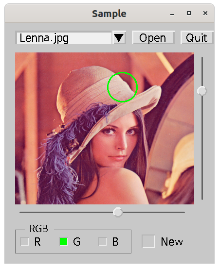
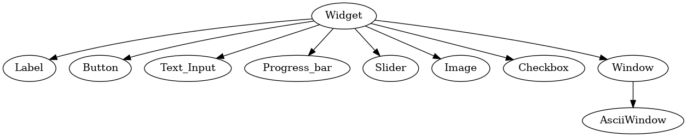

# OpenCV GUI

## License

LGPL v2

## Features

- Solely based on opencv (C++)  
- Cross platform : can be compiled on every platform that supports opencv
- Event driven
- ASCII art style GUI compose
- fully use modern c++ 


## Sample Image



## Supported Widgets

- Button
- Label
- Checkbox
- radiobutton
- frame
- Text input
- combo box
- scale
- Image
- Slider
- Progress bar
- Window
- popup window


## Useful for 

- small gui project that needs fast prototyping
- simple cross platform gui
- gui for opencv parameter tuning


## Sample Image is made with this Code

```c++
#include<filesystem>
#include"zgui.h"
using namespace std;

struct Pop : z::AsciiWindow, z::PopupInterface
{
	Pop() : z::PopupInterface{this}, z::AsciiWindow{R"(
		WMessage---------------------------
		|
		|    L0--------------------------
		|    ||
		|    L1--------------------------
		|    ||
		|
		|    B0----------    B1----------
		|    |Yes|           |No|
		|)"}
	{
		B[0]->click([this]() { quit(1); });
		B[1]->click([this]() { quit(0); });
	}

	void set(string s1, string s2) {
		L[0]->text(s1); L[1]->text(s2);
		update(*L[0]); update(*L[1]);
	}
};

struct Win : z::AsciiWindow
{
	Pop pop;
	cv::Mat m;
	int x, y;
	cv::Scalar color;

	Win() : z::AsciiWindow{R"(
		WSample------------------------------------
		| 
		| T0------------------B0- B1------- B2-----
		| |Open File|         ||  |Open|    |Quit|
		|
		| I0-----------------------------------S1-
		| ||                                   |1 100 1|
		| |                                    |
		| |                                    |
		| |                                    |
		| |                                    |
		| |                                    |
		| |                                    |
		| |                                    |
		| |                                    |
		| |                                    |
		| |                                    |
		| |                                    |
		| |                                    |
		| |                                    |
		| |                                    |
		| |                                    |
		| |                                    |
		| |                                    |
		| |                                    |
		| |                                    |
		| S0----------------------------------
		| |1 100 1|
		|
		|
		|  C0 L0-  C1 L1-  C2 L2-   C3- L3----
		|  |v||R|  || |G|  || |B|   ||  |New|
		|
		|)"}
	{
		vector<string> v;
		for(const filesystem::path &p : filesystem::directory_iterator("./"))
			if(is_regular_file(p) && p.extension() == ".png" || p.extension() == ".jpg")
				v.push_back(p.filename());
		tie("File open", 30, *T[0], *B[0], v);//combo box
		tie(*C[0], *C[1], *C[2]);//radio button
		wrap("RGB", 20, 10, *C[0], *L[2]);
		start();

		B[1]->click([this]() {
				*I[0] = cv::imread(T[0]->value());
				*this << *I[0];
				m = I[0]->mat_.clone();
		});
		B[2]->click([this]() { pop.set("Really?", ""); if(pop.open()) cv::destroyAllWindows(); });
		S[0]->on_change([this](int val) { draw_circle(); });
		S[1]->on_change([this](int val) { draw_circle(); });
		C[3]->on_change([this](bool t) {
				if(t) cv::imshow("new", m);
				else cv::destroyWindow("new");
		});
	}

	void draw_circle()
	{
		if(C[0]->checked()) color = {0,0,255};
		else if(C[1]->checked()) color = {0,255,0};
		else color = {255,0,0};
		I[0]->mat_ = m.clone();
		int x = m.cols * S[0]->value() / 100;
		int y = m.rows * (100 - S[1]->value()) / 100;
		cv::circle(I[0]->mat_, {x, y}, 30, color, 2);
		*this << *I[0];
	}
};


int main()
{
	Win win;
	win.loop();
}

```

## ASCII drawing Rules

- Capital letter stands for 
  - B : Button
  - C : CheckBox
  - T : Text Input
  - W : Window
  - P : Progress bar
  - S : Slider
  - I : Image
  - L : Label

- Capital letter is followed by a number : this should be one digit and it is the index of this widget.
- Capital letter is followed by '------' : this determines the length of the widget.
- Capital letter is followed by '|' vertically : this determines the height of the widget
- the first line below the Capital letter contains some text and close with another ''|''
  - this is the text of the widget 
  - Exceptionally in slider widget, it is start, end, step separated by space.
  - in Checkbox widget, v should be used to indicate that it is checked.
- Window size should include all the child widgets.

## Combining Rules

- Popup window is made from Window widget by inheriting popup interface
- Combo box is made by tying Text input and Button.
- Numeric spinbutton is made by tying Text input and two buttons.
- RadioButton is made by tying many checkboxes.
- Frame is made by wrapping multiple widgets
- more than 10 widgets can be present in a window 

## Widget Hierachy



## Reference

#### Widget

```c++
Widget(cv::Rect_<int> r);
```

widget will be visible with the size and position of rectangle r

```c++
bool focus();
```

check if widget is currently focused or not. Focused widget will get the keyboard input.

```c++
void focus(bool true_or_false);
```

set focus

#### Label

```c++
Label(std::string text, cv::Rect2i r);
```

Label will be created with text at the position r;

```c++
void text(std::string s);
```

sets the text as s;

```c++
std::string text();
```

gets the text of a label.

#### Button

```c++
Button(std::sting t, cv::Rect_<int> r);
```

Button with text t at position and size of r;

```c++
void click(std::function<void()> f);
```

sets the function to be executed when the button is clicked.

```c++
void text(std::string s);
```

sets the button text

#### CheckBox

```c++
CheckBox(cv::Rect2i r);
```

create a checkbox with position and size of r

```c++
void click(std::function<void()> f);
```

sets the function to be executed when the button is clicked.

```c++
void text(std::string s);
```

sets the text of checkbox

#### TextInput

```c++
TextInput(cv::Rect2i r);
```

create a TextInput with position and size of r

```c++
std::string value();
```

gets the text inside the text input

```c++
void value(std::string s);
```

sets the text inside the text input

```c++
void enter(std::function<void(std::string)> f);
```

sets the function to be executed when the keyboard enter is pushed.

#### Window

```c++
Window(std::string title, cv::Rect_<int> r);
```

create a window with title and position and size of r

```c++
void show();
```

show all the child widgets in the window

```c++
Window &operate+(Widget &w);
```

add a child widget to this window

```c++
Window &operator<<(Widget &r);
```

update and show a Widget r in this window

```c++
int loop();
```

start main loop. Keyboard input is processed with this function.

```c++
void close();
```

close this window

```c++
void start(int flag = cv::WINDOW_NORMAL | cv::WINDOW_KEEPRATIO);
```

show the window and process the mouse event.

This should be called after all the child widgets are created.

```c++
void keyboard_callback(int key);
```

```c++
void update(const Widget &r);
```

refresh widget r.

```c++
std::string title();
```

get the title of the window

```c++
void resize(cv::Rect2i r);
```

resize the window

```c++
void tie(std::string title, int font, TextInput &t, Button &b, std::vector<std::string> v, int x = -1, int y = -1);
```

create a combo box by tying textinput t and button b. 

a popup window will appear with buttons of all the string in vector v.

you can specify the place where the popup will appear with x and y.

```c++
void tie(TextInput &t, Button &b1, Button &b2, double start = 0, double step = 1);
```

create a numeric spin button by tying a textinput and two button.

start is the number you begin with.

step will be the amount to change when you click the button.

```c++
template<class... T>
void wrap(const char *title, int font, int N, const T&... widgets);
```

create a frame by wraping many widgets.

```c++
template<class... T> void tie(T&... checks);
```

create a radiobutton group by combining many check boxes.

#### Image

```c++
Image(cv::Rect2i r);
```

create a Image with position and size of r

```c++
cv::Mat &operator=(const cv::Mat &r);
```

gets the image from matrix r

#### Slider

```c++
Slider(cv::Rect2i r, int start, int stop, int step);
```

create a slider widget with size and position of r.

```c++
int value();
```

get the current value

```c++
void value(int v);
```

set the value

```c++
void on_change(std::function<void(int)> f);
```

sets the function to execute on slider change event

```c++
void draw();
```

draw the slider

#### Progress

```c++
Progress(cv::Rect2i r);
```

create a widget with size and position of r.

```c++
int value();
```

get the current value

```c++
void value(int v);
```

set the value

#### AsciiWindow

```c++
AsciiWindow(const char *asciiart, int unit_width = 10, int unit_height = 15, int margin = 1);
```

create a Asciiwindow with asciiart string.

unit_width : one character of - is equivalent of this value

unit_height : one character of | is equivalent of this value

margin : default margin for the window

#### PopupInterface

```c++
PopupInterface(Window *p);
```

sets a popup interface to window p

```c++
int open(int flag = cv::WINDOW_AUTOSIZE), int x = -1, int y = -1);
```

open a popup window with flag.

when the pop up window closes with quit(k), this function returns k.

popup appearing position can be set manually with x, y

```c++
void quit(int r);
```

popup window will collapse and return r